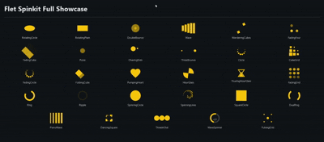

# FletSpinkit for Flet

**FletSpinkit** is a versatile Flet extension that brings over **30 beautiful, animated loading indicators** to your Flet applications.  
It is based on the popular `flutter_spinkit` package and is designed to work seamlessly with **Flet's layout system**.

---

## ✨ Features

- 30+ animated loading indicators
- Inspired by `flutter_spinkit`
- Fully compatible with Flet layouts
- IDE-friendly auto-suggestions via helper class
- Customizable size, color, tooltip, and value

---

## 📌 Examples

### Basic Implementation

To use a spinner, simply import **FletSpinkit** and add it to your page.

```python
import flet as ft
from flet_spinkit import FletSpinkit

def main(page: ft.Page):
    page.vertical_alignment = ft.MainAxisAlignment.CENTER
    page.horizontal_alignment = ft.CrossAxisAlignment.CENTER

    page.add(
        FletSpinkit(
        type=FletSpinkit.Spinkits.WAVE,
        color="red",
        size=50
        )
    )

ft.run(main)
```

### Advance Implementation

```python
import flet as ft
from flet_spinkit import FletSpinkit

def main(page: ft.Page):
    page.title = "Flet Spinkit Gallery"
    page.theme_mode = ft.ThemeMode.DARK
    page.padding = 20
    page.scroll = ft.ScrollMode.ADAPTIVE
    
    # Get all animation names from our Spinkits class
    # We filter out internal Python attributes (starting with __)
    spinkit_types = [
        value for name, value in FletSpinkit.Spinkits.__dict__.items() 
        if not name.startswith("__") and isinstance(value, str)
    ]

    gallery = ft.ResponsiveRow(
        alignment=ft.MainAxisAlignment.CENTER,
        vertical_alignment=ft.CrossAxisAlignment.CENTER,
    )

    for sk_type in spinkit_types:
        gallery.controls.append(
            ft.Container(
                content=ft.Column(
                    controls=[
                        FletSpinkit(
                            type=sk_type,
                            color=ft.Colors.AMBER,
                            size=50
                        ),
                        ft.Text(sk_type, size=12, weight=ft.FontWeight.W_300)
                    ],
                    horizontal_alignment=ft.CrossAxisAlignment.CENTER,
                ),
                padding=10,
                col={"sm": 6, "md": 4, "lg": 2}, # Responsive layout
            )
        )

    page.add(
        ft.Text("Flet Spinkit Full Showcase", size=32, weight=ft.FontWeight.BOLD),
        ft.Divider(),
        gallery
    )

ft.run(main)
```



## Installation

Add dependency to `pyproject.toml` of your Flet app:

* **Git dependency**

Link to git repository:

```
dependencies = [
  "flet-spinkit @ git+https://github.com/Muddassir-Farooq-official/flet_spinkit.git",
  "flet>=0.80.5",
]
```

* **uv/pip dependency**  

If the package is published on pypi.org:

```
dependencies = [
  "flet-spinkit",
  "flet>=0.80.5",
]
```

Build your app:
```
flet build windows -v
```

## Full Animation List

ROTATING_CIRCLE (Default)

ROTATING_PLAIN

DOUBLE_BOUNCE

WAVE

WANDERING_CUBES

FADING_FOUR

FADING_CUBE

PULSE

CHASING_DOTS

THREE_BOUNCE

CIRCLE

CUBE_GRID

FADING_CIRCLE

FOLDING_CUBE

PUMPING_HEART

HOUR_GLASS

POURING_HOUR_GLASS

FADING_GRID

RING

RIPPLE

SPINNING_CIRCLE

SPINNING_LINES

SQUARE_CIRCLE

DUAL_RING

PIANO_WAVE

DANCING_SQUARE

THREE_IN_OUT

WAVE_SPINNER

PULSING_GRID

## Documentation

[Link to documentation](https://MyGithubAccount.github.io/flet-spinkit/)


